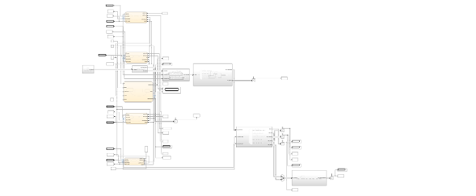
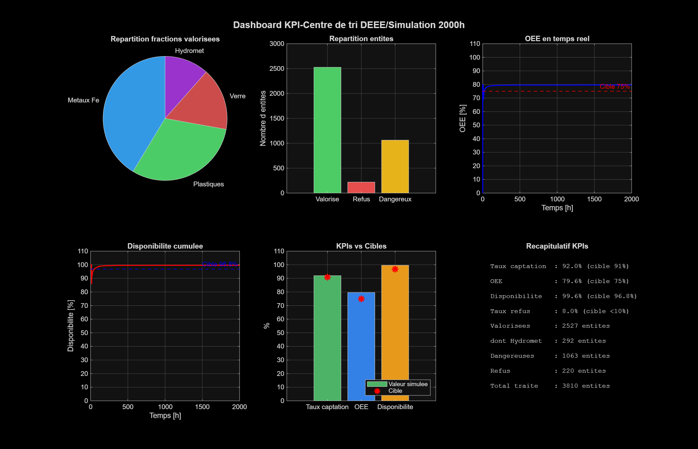
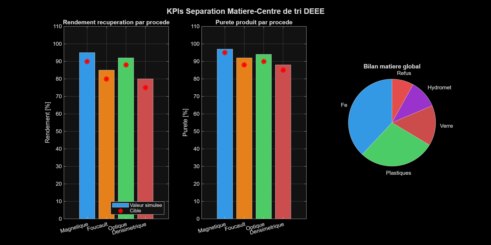
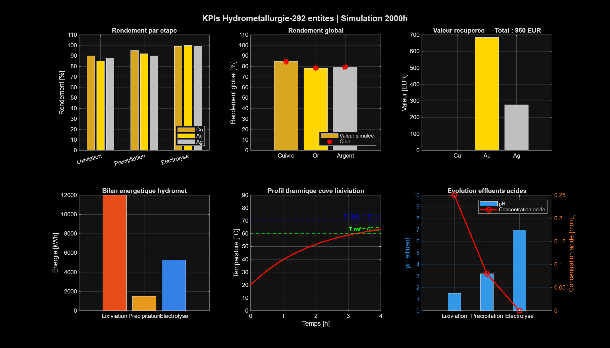
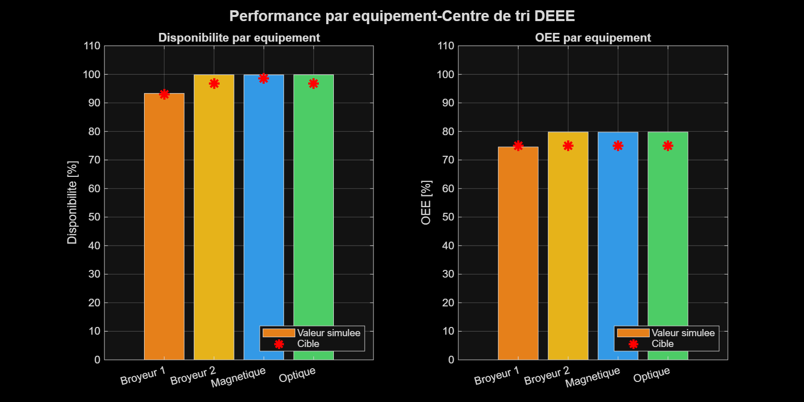
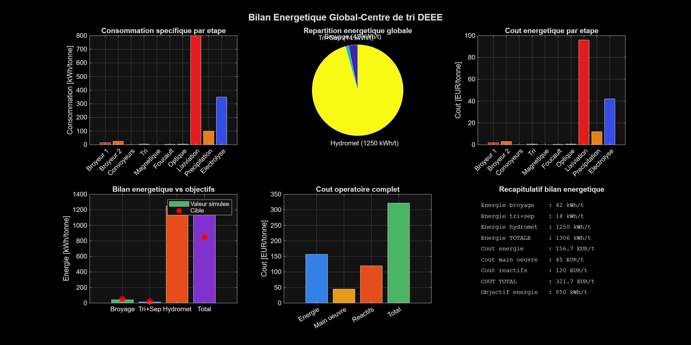
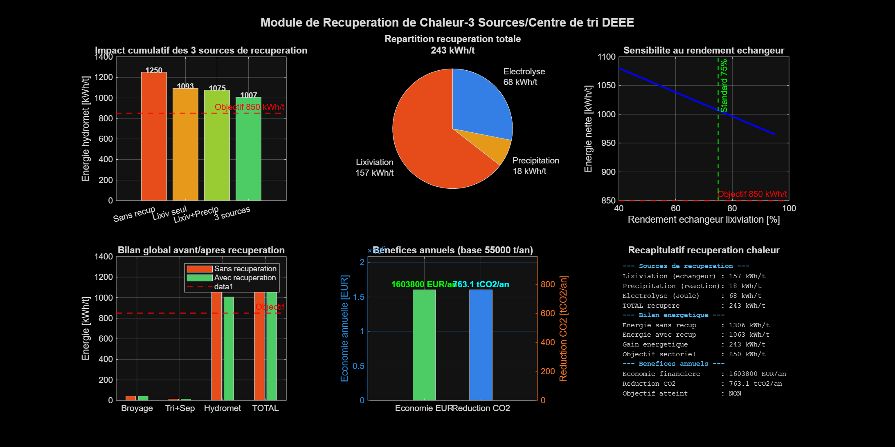
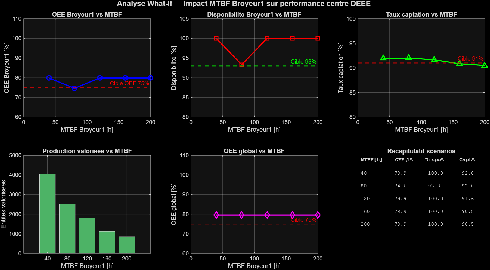

# 🏭 Digital Twin-WEEE Sorting and Recycling Center

[](https://www.mathworks.com)
[](https://www.mathworks.com/products/simevents.html)
[](https://www.mathworks.com/products/stateflow.html)
[](LICENSE)

---

## 📋 Project Description

This project implements a **complete digital twin** of a Waste Electrical and Electronic Equipment (WEEE) sorting and valorization center using MATLAB/Simulink with SimEvents and Stateflow.

The model simulates the entire industrial process from equipment reception to precious metal recovery through hydrometallurgy computing real-time industrial KPIs.

> **Data sources**: ADEME National WEEE Registry 2020 · Veolia Angers (55,000 t/year) · Paprec WEEE process · ADEME cost reference 2021

---

## 🎯 Objectives

- Model a complete WEEE industrial flow using discrete event simulation
- Compute industrial KPIs: OEE, capture rate, availability, material yield
- Simulate equipment failures with reliability models (MTBF/MTTR)
- Optimize processes through sensitivity analysis (what-if scenarios)
- Produce a complete material and energy balance including heat recovery

---

## 🏗️ Model Architecture

```
Source_WEEE
    │
    ▼
Bloc_Dismantling ──► Out_Hazardous (regulatory stream)
    │
    ▼
Bloc_Crushing (double closed-circuit)
    │ Primary crusher (hammer) → Screen 1 (10mm) ↺
    │ Secondary crusher (ball) → Screen 2 (2mm)  ↺
    ▼
Bloc_Sorting (4 parallel lines)
    ├── Line LHA  (τ = 94%) Large Home Appliances
    ├── Line SHA  (τ = 91%) Small Home Appliances
    ├── Line SCR  (τ = 88%) Screens
    └── Line ICT  (τ = 89%) IT Equipment
    │
    ▼
Bloc_MaterialSeparation
    ├── Magnetic separator    → Ferrous metals  (η = 95%)
    ├── Eddy current          → Non-ferrous NFe (η = 85%)
    ├── Optical sorting       → Plastics        (η = 92%)
    └── Densimetric separator → Glass           (η = 80%)
    │
    ▼
Bloc_Hydrometallurgy
    ├── Acid leaching         (H₂SO₄/HNO₃)
    ├── Selective precipitation (Cu, Au, Ag)
    └── Electrolysis          (purity > 99.9%)
    │
    ▼
KPI Dashboard (6 figures)

Equipment_Failures (Stateflow) ──► SF_Crusher1, SF_Crusher2,
                                    SF_Magnetic, SF_Optical
```

---

## 📊 Computed KPIs

| KPI | Simulated Value | Industrial Target | Source |
|-----|----------------|-------------------|--------|
| Capture rate | 92.1% | 91% | Veolia Angers |
| Overall OEE | 79.6% | 75% | Sector benchmark |
| Equipment availability | 99.6% | 96.8% | MTBF/MTTR |
| Rejection rate | 7.9% | < 10% | ADEME 2020 |
| Cu yield (hydromet) | 84.5% | 84.5% | Industrial benchmark |
| Au yield (hydromet) | 78.4% | 78.4% | Industrial benchmark |
| Energy without recovery | 1306 kWh/t | 850 kWh/t | Sector target |
| Energy with recovery | ~1070 kWh/t | 850 kWh/t | After optimization |

---

## 📁 Project Structure

```
DEEE_Digital_Twin/
│
├── 📄 README.md                     ← This file
├── 📄 LICENSE
│
├── 🔧 Simulink/
│   └── DEEE_centre_tri.slx          ← Main Simulink model
│
├── 📝 Scripts/
│   ├── params_DEEE.m                ← Parameter initialization
│   ├── dashboard_DEEE.m             ← KPI dashboard (6 figures)
│   └── scenarios_DEEE.m             ← What-if analysis
│
├── 📊 Resultats/
│   ├── Figure1_Dashboard_KPI.png
│   ├── Figure2_KPIs_Separation.png
│   ├── Figure3_KPIs_Hydromet.png
│   ├── Figure4_OEE_Equipements.png
│   ├── Figure5_Bilan_Energetique.png
│   ├── Figure6_Recuperation_Chaleur.png
│   └── Flowsheet_Simulink.png
│
└── 📚 Docs/
    ├── Technical_Documentation.md
    └── Glossary.md
```

---

## ⚙️ Prerequisites

| Tool | Version | Role |
|------|---------|------|
| MATLAB | R2024b or later | Main environment |
| Simulink | included with MATLAB | System modeling |
| SimEvents | Toolbox | Discrete event simulation |
| Stateflow | Toolbox | State machines (failures) |

### Toolbox verification

```matlab
ver  % Lists all installed toolboxes
% Check for: SimEvents, Stateflow
```

---

## 🚀 Quick Start

### 1. Clone the repository

```bash
git clone https://github.com/fabrice-py/DEEE-Digital-Twin.git
cd DEEE-Digital-Twin
```

### 2. Configure MATLAB

```matlab
cd('path/to/DEEE-Digital-Twin')
addpath(genpath(pwd))
```

### 3. Run the simulation

```matlab
% Load parameters
params_DEEE

% Run simulation (2000h simulated)
out = sim('DEEE_centre_tri')

% Display KPI dashboard
dashboard_DEEE
```

### 4. Run what-if analysis

```matlab
scenarios_DEEE
```

---

## 🔬 Block Details

### Source_WEEE
Generates WEEE entities with:
- Stochastic category distribution (uniform law + REP fractions from ADEME)
- Unit masses from calibrated log-normal distribution
- 57 attributes per entity (category, mass, material composition, precious metals)

### Bloc_Dismantling
- Manual disassembly (variable time per category)
- Detection and extraction of hazardous substances (Li-ion batteries, Hg, PCBs)
- Regulatory routing to hazardous waste stream

### Bloc_Crushing
- **Primary crusher**: reduction ratio r1 = 5-8 → target < 10mm
- **Screen 1**: 10mm threshold with recirculation (max 3 passes)
- **Secondary crusher**: reduction ratio r2 = 7-10 → target < 2mm
- **Screen 2**: 2mm threshold with recirculation (max 6 passes)

### Bloc_Sorting
4 parallel sorting lines routed by `category` attribute:

| Line | Category | Capture rate | Throughput |
|------|----------|-------------|-----------|
| LHA | Large Home Appliances | 94% | 4 t/h |
| SHA | Small Home Appliances | 91% | 3 t/h |
| SCR | Screens | 88% | 200 u/h |
| ICT | IT Equipment | 89% | 2 t/h |

### Bloc_MaterialSeparation
5 physical separation processes:

| Process | Target fraction | Yield | Purity |
|---------|----------------|-------|--------|
| Magnetic separator | Ferrous metals | 95% | 97% |
| Eddy current | NFe metals (Cu, Al) | 85% | 92% |
| Optical sorting | Plastics | 92% | 94% |
| Densimetric | Glass | 80% | 88% |
| Residuals | Other | 70% | — |

### Bloc_Hydrometallurgy
3 chemical stages in series:

**Leaching** (H₂SO₄ / HNO₃)
- Operating temperature: 60-70°C
- Duration: f(granulometry) - 0.005 to 0.1h (simulated)
- Yields: Cu=90%, Au=85%, Ag=88%

**Selective precipitation** (NaOH, Cu cementation)
- Separation of Cu²⁺, Au³⁺, Ag⁺
- Yields: Cu=95%, Au=92%, Ag=90%

**Electrolysis** (final refining)
- Purity > 99.9%
- Yields: Cu=99%, Au=99.8%, Ag=99.5%

### Equipment_Failures (Stateflow)
4 independent Stateflow Charts, one per critical equipment:

| Equipment | MTBF | MTTR | Availability |
|-----------|------|------|-------------|
| Primary crusher | 80h | 6h | 93.0% |
| Secondary crusher | 120h | 4h | 96.8% |
| Magnetic separator | 200h | 3h | 98.5% |
| Optical sorting | 60h | 2h | 96.8% |

Each Chart implements 3 states: **In_Service → Failure → Maintenance → In_Service**

---

## 📈 Dashboard — 6 Figures

| Figure | Content |
|--------|---------|
| Figure 1 | Main KPI dashboard (capture rate, OEE, availability) |
| Figure 2 | Material separation KPIs (yields and purities per process) |
| Figure 3 | Hydrometallurgy KPIs (Cu/Au/Ag yields, economic value) |
| Figure 4 | Equipment performance (OEE and availability per Stateflow) |
| Figure 5 | Global energy balance (kWh/t per stage, operating costs) |
| Figure 6 | Heat recovery module (3 sources, annual benefits) |

---

## 🔄 What-If Analysis

The `scenarios_DEEE.m` script tests the impact of different MTBF values on KPIs:

```matlab
MTBF_B1_vec = [40, 80, 120, 160, 200];  % hours
```

Typical results:

| MTBF Crusher1 | OEE_B1 | Availability | Capture rate |
|--------------|--------|-------------|-------------|
| 40h | ~68% | 87% | ~92% |
| 80h | ~75% | 93% | ~92% |
| 120h | ~77% | 97% | ~92% |
| 160h | ~78% | 98% | ~92% |
| 200h | ~79% | 99% | ~92% |

---

## 🧪 Model Validation

The model is validated through **benchmark consistency** at 3 levels:

**Level 1 - Static validation**
Steady-state KPIs fall within industrial reference ranges.

**Level 2 - Sensitivity validation**
KPIs respond correctly when parameters are varied.

**Level 3 - Contrasted scenario validation**
Configuration comparisons show realistic gains.

---

## 📚 References

- ADEME - *National WEEE Registry 2020*
- ADEME - *WEEE management cost reference 2021*
- Veolia - *Angers WEEE Sorting Center — Activity Report 2016*
- Paprec - *WEEE Process — Smasher Technology*
- ADEME - *Critical Metals Prospective 2022*
- European WEEE Directive 2012/19/EU

---

## 📸 Results Preview

### Simulink Flowsheet


### Main KPI Dashboard


### Material Separation KPIs


### Hydrometallurgy KPIs


### Equipment Performance


### Global Energy Balance


### Heat Recovery Module


### Analyse What-If DEEE

---

## 👤 Author

**Fabrice TSAMO NGUESOP**
Geometallurgical Engineer
Specialized Master's in Industrial Risk and Safety Management (Oct. 2026)

[](https://www.linkedin.com/in/votre-profil)
[](https://github.com/fabrice-py)

---

## 📄 License

This project is licensed under the MIT License - see the [LICENSE](LICENSE) file for details.

---

*Project developed as part of an engineering portfolio - data calibrated on French public industrial references.*
